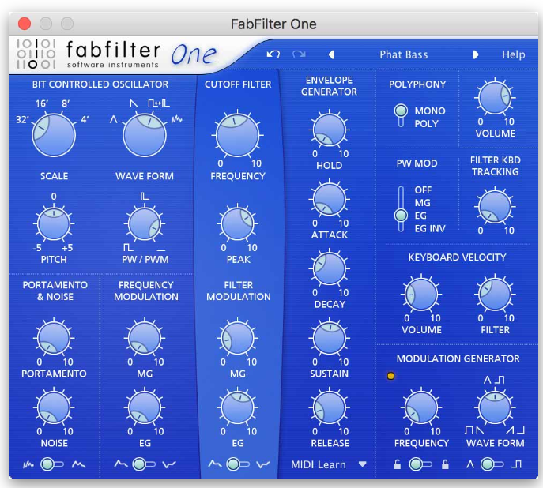

# simple-synth

Creating a synth to learn the web-audio api. The goal is create a synth that has the features 
that Fabilter's Synth One has:

## Basic Features

- [x] Waveform
- [ ] Octave Selector
- [ ] Noise 
- [ ] Keyboard

# Effects 

- [ ] Reverb
- [ ] Delay
